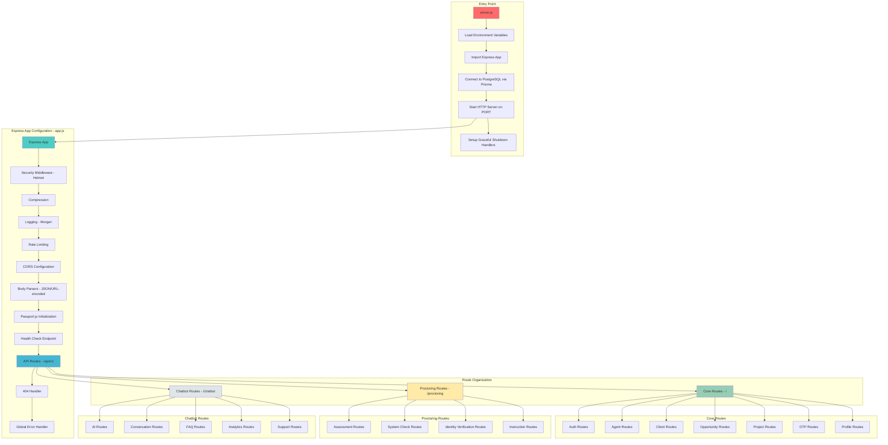
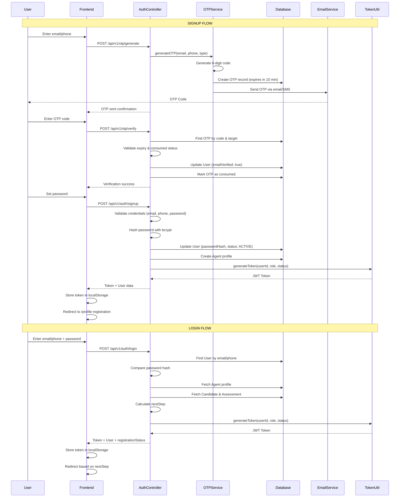
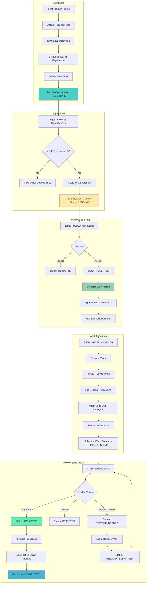
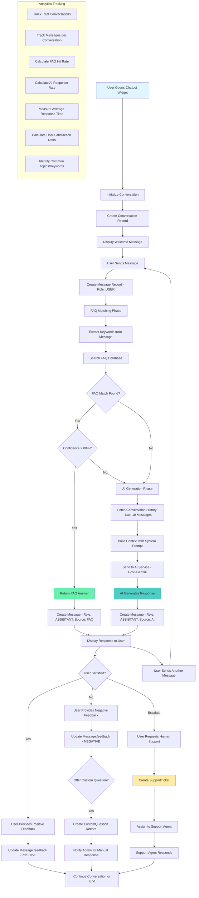
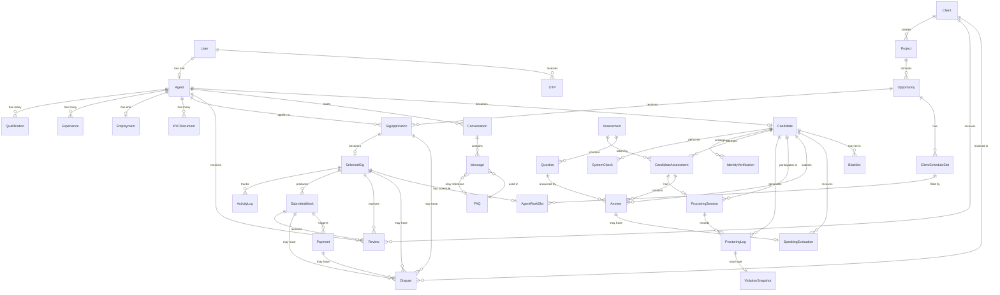

# Backend Architecture Flowcharts

## 1. Backend System Architecture

## 2. Authentication Flow - Signup & Login

## 3. Agent Onboarding Flow

```mermaid
graph TD
    A[User Visits Platform] --> B{Has Account?}
    B -->|No| C[Email/Phone Verification - OTP]
    B -->|Yes| D[Login]
    
    C --> E[Set Password - Signup]
    E --> F[User Created - Status: ACTIVE]
    F --> G[Agent Profile Auto-Created]
    
    D --> H{Check Registration Status}
    
    H --> I{Email/Phone Verified?}
    I -->|No| C
    I -->|Yes| J{Profile Completed?}
    
    J -->|No| K[Profile Registration Page]
    K --> L[Enter Personal Details]
    L --> M[Add Qualifications]
    M --> N[Add Experience]
    N --> O[Upload Profile Photo]
    O --> P[Save Profile - profileCompleted: true]
    
    J -->|Yes| Q{KYC Status?}
    
    Q -->|PENDING/REJECTED| R[KYC Verification Page]
    R --> S[Upload Aadhar - Front & Back]
    S --> T[Upload PAN Card]
    T --> U[Submit for Verification]
    U --> V{Admin Review}
    V -->|Approved| W[kycStatus: APPROVED]
    V -->|Rejected| X[kycStatus: REJECTED - Retry]
    X --> R
    
    Q -->|APPROVED| Y{Assessment Status?}
    
    Y -->|NOT_STARTED/FAILED| Z[Assessment Instructions]
    Z --> AA[System Check]
    AA --> AB{System Compatible?}
    AB -->|No| AC[Show Requirements & Exit]
    AB -->|Yes| AD[Device Test - Webcam/Mic]
    AD --> AE{Devices Working?}
    AE -->|No| AC
    AE -->|Yes| AF[Identity Verification]
    AF --> AG{Face Verified?}
    AG -->|No| AH[Retry or Manual Review]
    AG -->|Yes| AI[Enter Fullscreen]
    AI --> AJ[Start Proctored Test]
    AJ --> AK[Complete Assessment]
    AK --> AL[Assessment Evaluated]
    AL --> AM[CEFR Level Assigned]
    
    Y -->|COMPLETED| AN{Agreement Signed?}
    
    AN -->|No| AO[Agreements Page]
    AO --> AP[Review Terms & Conditions]
    AP --> AQ[Digital Signature]
    AQ --> AR[agreementSigned: true]
    
    AN -->|Yes| AS[Dashboard Access]
    
    P --> Q
    W --> Y
    AM --> AN
    AR --> AS
    
    AS --> AT[Browse Opportunities]
    AT --> AU[Apply for Gigs]
    AU --> AV[Work & Earn]
    
    style A fill:#e1f5ff
    style AS fill:#69f0ae
    style AV fill:#ffd54f
```

## 4. Opportunity Application & Gig Flow

## 5. Proctoring & Assessment System Flow

```mermaid
graph TD
    A[Agent Clicks Start Assessment] --> B[Instructions Page]
    B --> C[Accept Terms & Start]
    
    C --> D[System Check Phase]
    D --> E[Check Browser Compatibility]
    E --> F[Check Operating System]
    F --> G[Check Camera Availability]
    G --> H[Check Microphone Availability]
    H --> I[Check Network Speed]
    I --> J[Check Screen Resolution]
    J --> K[Check Fullscreen Capability]
    
    K --> L{All Checks Passed?}
    L -->|No| M[Display Failed Checks]
    M --> N[Show System Requirements]
    N --> O[Exit Assessment]
    
    L -->|Yes| P[SystemCheck Record - Status: PASSED]
    P --> Q[Device Test Page]
    
    Q --> R[Test Webcam Feed]
    R --> S[Test Microphone Recording]
    S --> T{Devices Working?}
    T -->|No| M
    T -->|Yes| U[Identity Verification Phase]
    
    U --> V[Load Face Detection Models]
    V --> W[Capture Live Photo]
    W --> X[Detect Face in Photo]
    X --> Y{Face Detected?}
    Y -->|No| Z[Show Error - Retry]
    Z --> W
    
    Y -->|Yes| AA[Extract Face Descriptor]
    AA --> AB[Compare with Reference Photo]
    AB --> AC{Similarity > Threshold?}
    AC -->|No| AD[Verification Failed]
    AD --> AE[Manual Review or Retry]
    AC -->|Yes| AF[IdentityVerification - Status: VERIFIED]
    
    AF --> AG[Enter Fullscreen Mode]
    AG --> AH[Create ProctoringSession]
    AH --> AI[Start Assessment Timer]
    
    AI --> AJ[Display Questions]
    
    subgraph "Real-time Monitoring"
        AK[Face Detection Every 5s]
        AL[Tab Switch Detection]
        AM[Fullscreen Exit Detection]
        AN[Mouse Leave Detection]
        AO[Keyboard Shortcut Detection]
        AP[Right-Click Detection]
        AQ[Network Disconnection Detection]
    end
    
    AJ --> AR{Violation Detected?}
    AR -->|Yes| AS[Create ProctoringLog]
    AS --> AT[Capture Screenshot - ViolationSnapshot]
    AT --> AU{Critical Violation?}
    AU -->|Yes| AV[Auto-Submit Test]
    AU -->|No| AW{Violation Count > Threshold?}
    AW -->|Yes| AV
    AW -->|No| AJ
    
    AR -->|No| AJ
    
    AJ --> AX{Time Up or All Answered?}
    AX -->|No| AJ
    AX -->|Yes| AY[Submit Test]
    
    AV --> AY
    
    AY --> AZ[Evaluate Answers]
    
    subgraph "Answer Evaluation"
        BA[AUDIO_MCQ - Auto-scored]
        BB[READING_MCQ - Auto-scored]
        BC[FILL_BLANK - Auto-scored]
        BD[SPEAKING - AssemblyAI Transcription]
        BD --> BE[Fluency, Accuracy, Pronunciation Scoring]
        BF[WRITING - Manual/AI Review]
        BF --> BG[Grammar, Coherence, Vocabulary Scoring]
    end
    
    AZ --> BH[Calculate Weighted Score]
    BH --> BI[Assign CEFR Level - A1 to C2]
    BI --> BJ[Update CandidateAssessment - Status: COMPLETED]
    BJ --> BK[Update Candidate - overallCEFRLevel]
    BK --> BL[Thank You Page]
    BL --> BM[Redirect to Next Step]
    
    style A fill:#e1f5ff
    style P fill:#69f0ae
    style AF fill:#69f0ae
    style AV fill:#ff6b6b
    style BJ fill:#4ecdc4
```

## 6. Chatbot System Flow

## 7. Database Schema Relationships

## 8. API Request Flow with Middleware

```mermaid
graph LR
    A[Client Request] --> B[Express App]
    B --> C[Helmet - Security Headers]
    C --> D[Compression]
    D --> E[Morgan - Logging]
    E --> F[Rate Limiter]
    F --> G{Rate Limit Exceeded?}
    G -->|Yes| H[429 Too Many Requests]
    G -->|No| I[CORS Validation]
    I --> J{Origin Allowed?}
    J -->|No| K[403 Forbidden]
    J -->|Yes| L[Body Parser]
    L --> M[Route Matching]
    M --> N{Protected Route?}
    N -->|Yes| O[Auth Middleware]
    O --> P{Valid JWT Token?}
    P -->|No| Q[401 Unauthorized]
    P -->|Yes| R{Required Role?}
    R -->|No| S[403 Insufficient Permissions]
    R -->|Yes| T[Controller]
    N -->|No| T
    T --> U[Service Layer]
    U --> V[Database - Prisma]
    V --> W[Response]
    W --> X[Success Response]
    
    T --> Y{Error Occurred?}
    Y -->|Yes| Z[Error Handler Middleware]
    Z --> AA[Error Response]
    
    M --> AB{Route Not Found?}
    AB -->|Yes| AC[404 Handler]
    AC --> AD[404 Not Found Response]
    
    style A fill:#e1f5ff
    style X fill:#69f0ae
    style H fill:#ff6b6b
    style K fill:#ff6b6b
    style Q fill:#ff6b6b
    style S fill:#ff6b6b
    style AA fill:#ff6b6b
    style AD fill:#ff6b6b
```

---

## Summary

These flowcharts illustrate the complete backend architecture of the HitouchCX platform, including:

1. **System Architecture**: Server initialization, Express configuration, and route organization
2. **Authentication**: Signup and login flows with OTP verification
3. **Agent Onboarding**: Multi-step registration process from signup to dashboard access
4. **Opportunity Management**: Application, selection, work execution, and payment flow
5. **Proctoring System**: Comprehensive assessment flow with real-time monitoring
6. **Chatbot System**: FAQ matching, AI generation, and support escalation
7. **Database Relationships**: Entity relationships across 30+ models
8. **API Request Flow**: Middleware stack and request processing pipeline

The backend is built with security, scalability, and maintainability as core principles, using modern Node.js/Express patterns with Prisma ORM for database management.
