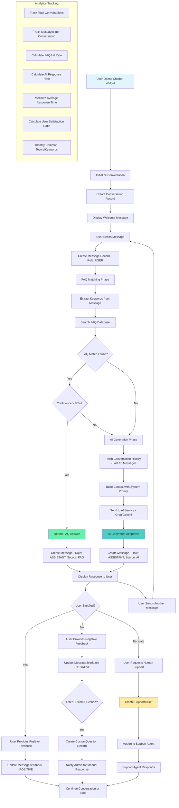

## 6. Chatbot System Flow

```mermaid
graph TD
    A[User Opens Chatbot Widget] --> B[Initialize Conversation]
    B --> C[Create Conversation Record]
    C --> D[Display Welcome Message]
    
    D --> E[User Sends Message]
    E --> F[Create Message Record - Role: USER]
    
    F --> G[FAQ Matching Phase]
    G --> H[Extract Keywords from Message]
    H --> I[Search FAQ Database]
    I --> J{FAQ Match Found?}
    
    J -->|Yes| K{Confidence > 80%?}
    K -->|Yes| L[Return FAQ Answer]
    L --> M[Create Message - Role: ASSISTANT, Source: FAQ]
    M --> N[Display Response to User]
    
    K -->|No| O[AI Generation Phase]
    J -->|No| O
    
    O --> P[Fetch Conversation History - Last 10 Messages]
    P --> Q[Build Context with System Prompt]
    Q --> R[Send to AI Service - Groq/Gemini]
    R --> S[AI Generates Response]
    S --> T[Create Message - Role: ASSISTANT, Source: AI]
    T --> N
    
    N --> U{User Satisfied?}
    U -->|Yes| V[User Provides Positive Feedback]
    V --> W[Update Message.feedback - POSITIVE]
    
    U -->|No| X[User Provides Negative Feedback]
    X --> Y[Update Message.feedback - NEGATIVE]
    Y --> Z{Offer Custom Question?}
    Z -->|Yes| AA[Create CustomQuestion Record]
    AA --> AB[Notify Admin for Manual Response]
    
    U -->|Escalate| AC[User Requests Human Support]
    AC --> AD[Create SupportTicket]
    AD --> AE[Assign to Support Agent]
    AE --> AF[Support Agent Responds]
    
    N --> AG[User Sends Another Message]
    AG --> E
    
    subgraph "Analytics Tracking"
        AH[Track Total Conversations]
        AI[Track Messages per Conversation]
        AJ[Calculate FAQ Hit Rate]
        AK[Calculate AI Response Rate]
        AL[Measure Average Response Time]
        AM[Calculate User Satisfaction Ratio]
        AN[Identify Common Topics/Keywords]
    end
    
    W --> AO[Continue Conversation or End]
    AB --> AO
    AF --> AO
    
    style A fill:#e1f5ff
    style L fill:#69f0ae
    style S fill:#4ecdc4
    style AD fill:#ffeaa7
```
